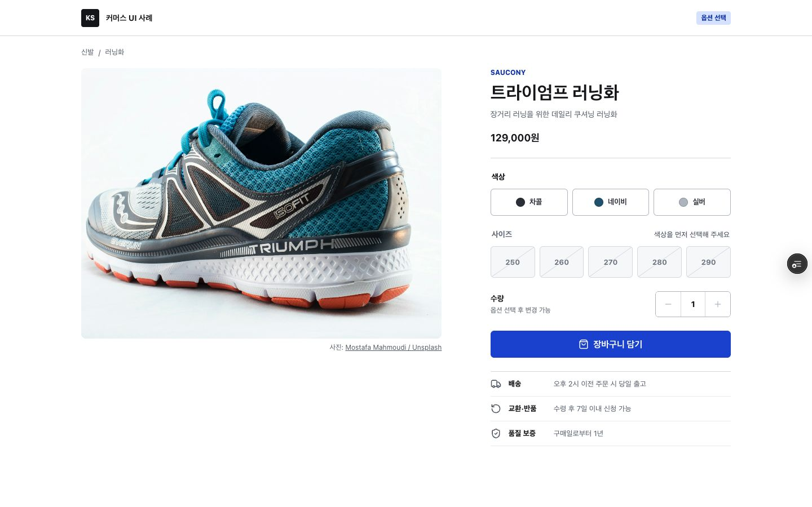
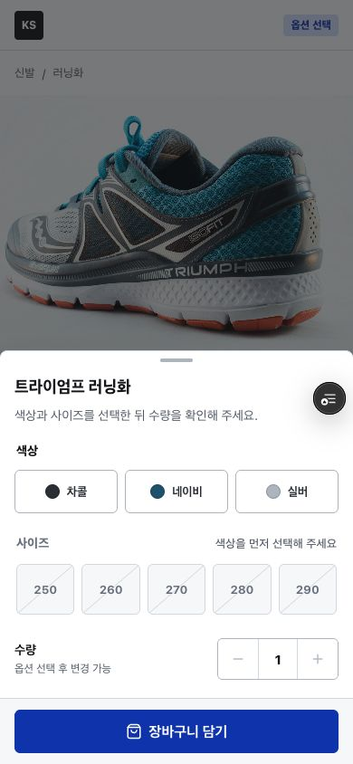

# KS UI

서비스 UI를 운영하며 자주 만난 상태와 검증 기준을 공개 가능한 형태로 다시 만든 React 컴포넌트 프로젝트입니다.

- [상품 옵션 선택 화면](https://ksungz-ui.vercel.app/?path=/story/patterns-commerce-상품-옵션-선택--default)
- [설계와 검증 기록](https://ksungz-ui.vercel.app/?path=/story/case-studies-상품-옵션-선택--design-and-verification)
- [전체 Storybook](https://ksungz-ui.vercel.app)
- [포트폴리오에서 보기](https://ksungz-github-io.vercel.app/portfolio)

## 대표 화면

### 데스크톱 구매 패널

[](https://ksungz-ui.vercel.app/?path=/story/patterns-commerce-상품-옵션-선택--default)

### 모바일 바텀시트

<p align="center">
  <a href="https://ksungz-ui.vercel.app/?path=/story/patterns-commerce-상품-옵션-선택--mobile-bottom-sheet">
    
  </a>
</p>

## 상품 옵션 선택 사례

상품상세 UI를 운영하며 쌓은 경험을 바탕으로 색상·사이즈 옵션 선택 흐름을 처음부터 다시 설계했습니다.

- 옵션 조합별 재고와 추가 금액 계산
- 색상 변경 시 기존 사이즈 선택의 유효성 확인
- 품절, 재고 부족, 최대 구매 수량 처리
- 필수 옵션 누락 시 오류 안내와 포커스 이동
- 데스크톱 구매 패널과 모바일 바텀시트
- 로딩, 판매 중지, 긴 상품명 등 운영 중 필요한 상태 문서화

결제나 실제 장바구니 API는 포함하지 않았습니다. 화면 상태와 검증 범위를 보여주는 데 필요한 흐름까지만 구현했습니다.

## 설계 기준

### 데이터와 선택 상태 분리

상품 정보와 옵션 조합은 `Product`와 `ProductVariant`로, 사용자가 고른 값은 `ProductSelection`으로 나눴습니다. 화면은 선택값을 기준으로 현재 조합의 재고와 단가를 계산합니다.

### 계산 로직과 화면 분리

재고 판정, 색상 변경 시 선택값 보정, 가격 계산, 구매 수량 제한은 순수 TypeScript 함수로 작성했습니다. UI를 렌더링하지 않아도 조합별 규칙을 테스트할 수 있습니다.

### 하나의 폼과 두 가지 배치

데스크톱 구매 패널과 모바일 바텀시트가 같은 선택 상태와 계산 규칙을 사용합니다. 현재 화면 크기에 필요한 폼만 렌더링해 중복 DOM과 상태 불일치를 피했습니다.

## 검증 결과

| 항목 | 결과 |
| --- | --- |
| 단위·상호작용 테스트 | 5개 파일, 12개 테스트 통과 |
| Storybook 접근성 검사 | 상품 화면과 설계 문서 위반 0건 |
| 반응형 확인 | 320px, 390px, 1440px |
| 정적 검사 | TypeScript, ESLint 통과 |
| 배포 검사 | GitHub Actions, Vercel 빌드 통과 |

## Storybook 구성

- 기초: 색상, 타이포그래피, 간격, 모서리, 그림자, 포커스, 모션 토큰
- 컴포넌트: Button, TextField, SelectField, Badge, Tabs, DialogSheet, Toast
- 패턴: UI 품질 검토, 상품 옵션 선택
- 구현 사례: 상태를 나눈 기준, 구현 판단, 검증 결과, 관련 소스

`DialogSheet`는 같은 API를 사용하면서 640px 이상에서는 Dialog, 그보다 작은 화면에서는 하단 안전 영역을 포함한 Bottom Sheet로 동작합니다. 포커스 잠금, Escape 닫기, 닫은 뒤 포커스 복귀, `prefers-reduced-motion` 설정을 함께 처리합니다.

## 기술 구성

- React 19, TypeScript
- Vite 8, Storybook 10
- CSS Variables, SCSS Modules
- Radix UI primitives
- Vitest, Testing Library
- GitHub Actions, Vercel

## 로컬 실행

`.nvmrc`에 지정한 Node 버전을 사용합니다.

```bash
nvm use
npm install
npm run storybook
```

검증 명령은 다음과 같습니다.

```bash
npm run typecheck
npm run lint
npm run test
npm run build:storybook
```

## 디렉토리

```text
src/
  components/     기본 컴포넌트, 스타일, Storybook, 테스트
  patterns/       실제 화면 흐름을 조합한 예제
  stories/        소개와 디자인 토큰 문서
  styles/         전역 토큰과 기본 스타일
  lib/            공통 유틸리티와 훅
```

## 구현 기준

- 상태는 숨겨진 CSS 조건보다 컴포넌트 속성과 데이터로 드러냅니다.
- 기본 HTML로 해결할 수 있는 동작은 native element를 우선합니다.
- Dialog처럼 포커스 관리가 중요한 UI는 검증된 primitive를 사용합니다.
- 상태를 색상 하나로만 전달하지 않습니다.
- 카드 모서리는 최대 8px로 제한합니다.

## 이미지 출처

상품 옵션 선택 사례의 러닝화 사진은 [Mostafa Mahmoudi의 Unsplash 이미지](https://unsplash.com/photos/Kgw9XZEqrak)를 사용했습니다.

## 라이선스

MIT
